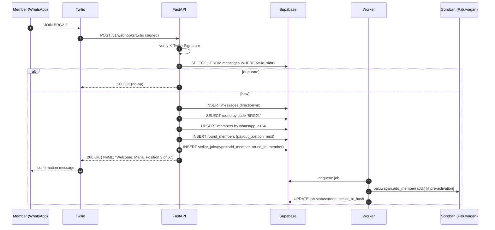
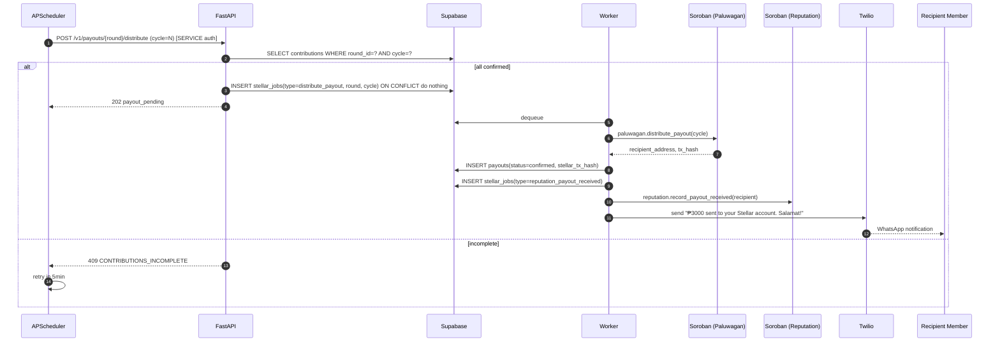

# DAMAY — System Architecture

> Phase 0 deliverable. Single source of truth for service shape, interface contracts, and async behavior. All engineering subagents read this before writing code.

---

## 1. Service Topology

```
┌────────────────────┐        ┌──────────────────────┐
│  Organizer PWA     │        │  Member (WhatsApp)   │
│  apps/web          │        │  Twilio Sandbox      │
│  Next.js 15        │        │                      │
└─────────┬──────────┘        └──────────┬───────────┘
          │ HTTPS + Supabase JWT          │ POST (Twilio signed)
          ▼                               ▼
   ┌──────────────────────────────────────────────┐
   │ FastAPI Gateway  (apps/api)                  │
   │  routers/  services/  clients/  workers/     │
   │  - JWT auth (organizer endpoints)            │
   │  - Twilio signature verify (webhook only)    │
   │  - Idempotency-Key middleware                │
   │  - SlowAPI rate limiter (60/min public)      │
   │  - Structured logs w/ request_id             │
   └────┬─────────────┬──────────────┬────────────┘
        │             │              │
   ┌────▼─────┐  ┌────▼──────┐  ┌────▼──────────────┐
   │ Supabase │  │ Twilio    │  │ Stellar           │
   │ Postgres │  │ WhatsApp  │  │  - Horizon (read) │
   │ Realtime │  │ Sandbox   │  │  - Soroban RPC    │
   │ Auth     │  │           │  │    (write queue)  │
   └──────────┘  └───────────┘  └───────────────────┘
                                  Contracts:
                                  - Reputation
                                  - Paluwagan (per round)
```

### 1.1 Service Responsibilities

| Service | Owns | Does not own |
|---|---|---|
| `apps/web` | Organizer UX, magic-link auth flow, Realtime subscriptions, server actions for organizer mutations | Member interactions, direct chain writes, secret material |
| `apps/api` | All writes to Supabase, all chain submissions, Twilio webhook intake, idempotency, retries, rate limits | UI rendering, organizer auth issuance (delegated to Supabase) |
| `apps/api/workers` | Stellar tx submission queue, cycle-deadline payout trigger, reputation event emission | Synchronous request handling |
| `contracts/reputation` | Per-member score, immutable event history, decay logic | Round state |
| `contracts/paluwagan` | Round state machine (init / contribute / payout / close), per-round member roster, auth on writes | Reputation scoring (calls Reputation via cross-contract) |
| Supabase Postgres | Off-chain system of record: profiles, round metadata, message logs, idempotency keys, job queue | Value transfer (lives on Stellar) |

### 1.2 Source-of-truth split

- **Off-chain (Supabase):** profiles, round metadata, message log, idempotency keys, async job queue, `stellar_tx_hash` references.
- **On-chain (Stellar):** contribution events, payout transfers, reputation deltas.
- **Joined by:** `members.stellar_account` ↔ Soroban `Address`. One-to-one.
- **Reconciliation:** nightly diff job (post-hackathon). For hackathon: every chain write writes back its `tx_hash` to the originating row; UI shows `pending` until Horizon confirms.

---

## 2. API Contracts (FastAPI Gateway)

All paths prefixed `/v1`. JSON I/O. All `4xx` and `5xx` follow the error envelope below.

### 2.1 Common envelope

**Error response (all non-2xx):**
```json
{ "error": { "code": "ROUND_NOT_FOUND", "message": "Round abc not found", "request_id": "req_..." } }
```

**Auth modes:**
- `JWT` — `Authorization: Bearer <supabase_jwt>`. Subject must resolve to an `organizers.id`.
- `TWILIO_SIG` — `X-Twilio-Signature` validated against raw body + URL.
- `SERVICE` — internal worker calls via service-role API key (never exposed to browser).
- `PUBLIC` — no auth (health, magic-link callbacks).

**Idempotency:** all `POST` endpoints accept `Idempotency-Key: <uuid>` header. Server stores `(key, route, request_hash, response_hash, status_code)` in `idempotency_keys` (24h TTL). Replay returns the stored response verbatim. Missing key on `POST` is allowed but discouraged (logged).

---

### 2.2 Endpoint table

| Method | Path | Auth | Purpose | Idempotency |
|---|---|---|---|---|
| GET | `/v1/healthz` | PUBLIC | Liveness + deep reachability (DB, Horizon, Twilio) | n/a |
| POST | `/v1/rounds` | JWT (organizer) | Create round (draft) | `Idempotency-Key` required |
| GET | `/v1/rounds` | JWT (organizer) | List rounds for caller | n/a |
| GET | `/v1/rounds/{round_id}` | JWT (organizer) | Round detail + members + timeline | n/a |
| POST | `/v1/rounds/{round_id}/activate` | JWT (organizer) | Deploy `Paluwagan` contract, flip to `active` | `Idempotency-Key` required |
| POST | `/v1/rounds/{round_id}/close` | JWT (organizer) | Close round (after final cycle) | `Idempotency-Key` required |
| POST | `/v1/members` | JWT (organizer) | Register a member (creates Stellar account on first registration) | `Idempotency-Key` required |
| GET | `/v1/members/{member_id}` | JWT (organizer) | Member detail (only if caller owns a round member belongs to) | n/a |
| POST | `/v1/rounds/{round_id}/members` | JWT (organizer) | Add member to round, assign payout position | `Idempotency-Key` required |
| POST | `/v1/contributions` | SERVICE | Record contribution intent; enqueues Soroban tx | `Idempotency-Key` required |
| GET | `/v1/contributions?round_id=&cycle=` | JWT (organizer) | List contributions filtered | n/a |
| POST | `/v1/payouts/{round_id}/distribute` | JWT (organizer) OR scheduler (SERVICE) | Trigger `distribute_payout(cycle)` on contract | `Idempotency-Key` required |
| GET | `/v1/reputation/{member_id}` | JWT (organizer) | Score + on-chain history | n/a |
| POST | `/v1/webhooks/twilio` | TWILIO_SIG | Inbound WhatsApp message | Dedupe on `MessageSid` |
| POST | `/v1/dev/simulate-message` | JWT (organizer, dev env only) | Demo backdoor: inject a synthetic inbound message | Dedupe on synthetic sid |

### 2.3 Detail per endpoint

#### `GET /v1/healthz` — PUBLIC
- **Response 200:**
  ```json
  { "status": "ok", "checks": { "db": "ok", "horizon": "ok", "twilio": "ok", "soroban_rpc": "ok" }, "version": "0.1.0" }
  ```
- **Errors:** 503 if any deep check fails; body still returns the `checks` map so ops can triage.
- **Timeout per check:** 800ms. Failures are degraded, not fatal — endpoint returns 200 if DB is up, 503 only if DB is down.

#### `POST /v1/rounds` — JWT
- **Request:**
  ```json
  { "name": "Barangay 21 Weekly", "contribution_amount_php": 500, "member_count": 6, "frequency": "weekly", "start_date": "2026-06-01" }
  ```
- **Response 201:**
  ```json
  { "id": "rnd_...", "status": "draft", "organizer_id": "org_...", "paluwagan_contract_id": null, ... }
  ```
- **Errors:** `400 VALIDATION_ERROR`, `401 UNAUTHENTICATED`, `409 IDEMPOTENCY_CONFLICT` (same key, different body).
- **Idempotency:** required header; stored response replayed on repeat.

#### `GET /v1/rounds` — JWT
- **Query:** `status` (optional), `limit` (default 20), `cursor` (opaque).
- **Response 200:** `{ "data": [Round, ...], "next_cursor": "..." | null }`.

#### `GET /v1/rounds/{round_id}` — JWT
- **Response 200:** `Round` + `members: RoundMember[]` + `contributions: Contribution[]` + `payouts: Payout[]`.
- **Errors:** `404 ROUND_NOT_FOUND` (also when caller is not owner — never leak existence).

#### `POST /v1/rounds/{round_id}/activate` — JWT
- **Request:** `{}`
- **Behavior:** validates round has `member_count` members with `stellar_account` set; deploys `Paluwagan` contract (queued job); on confirm sets `paluwagan_contract_id` and `status='active'`.
- **Response 202:** `{ "round_id": "...", "job_id": "...", "status": "activation_pending" }`
- **Errors:** `409 ROUND_NOT_READY`, `409 ALREADY_ACTIVE`.
- **Idempotency:** required; replay returns same `job_id`.

#### `POST /v1/rounds/{round_id}/close` — JWT
- **Response 202:** `{ "job_id": "...", "status": "close_pending" }`
- **Errors:** `409 NOT_ACTIVE`, `409 CYCLES_REMAINING`.

#### `POST /v1/members` — JWT
- **Request:** `{ "whatsapp_e164": "+639171234567", "display_name": "Maria Santos" }`
- **Response 201:** `Member` (with newly-generated `stellar_account` on testnet).
- **Errors:** `409 MEMBER_EXISTS` (by `whatsapp_e164`).

#### `POST /v1/rounds/{round_id}/members` — JWT
- **Request:** `{ "member_id": "mbr_...", "payout_position": 3 }`
- **Response 201:** `RoundMember`.
- **Errors:** `409 POSITION_TAKEN`, `409 ROUND_FULL`, `404 MEMBER_NOT_FOUND`.

#### `POST /v1/contributions` — SERVICE
- Called by the WhatsApp state machine when a member sends `PAY`.
- **Request:** `{ "round_id": "...", "member_id": "...", "cycle_number": 2, "amount_php": 500, "source_message_sid": "SMxxxx" }`
- **Response 202:** `{ "contribution_id": "...", "status": "pending", "job_id": "..." }`
- **Behavior:** insert row with `status='pending'`; enqueue Soroban `contribute(member, cycle)` job; webhook handler returns 200 immediately to Twilio.
- **Idempotency:** keyed on `(round_id, member_id, cycle_number)` AND `Idempotency-Key`. Duplicate WhatsApp messages (same `MessageSid`) are caught upstream.

#### `POST /v1/payouts/{round_id}/distribute` — JWT or SERVICE
- **Request:** `{ "cycle_number": 2 }`
- **Behavior:** confirms cycle deadline passed; calls `Paluwagan.distribute_payout(cycle)`; on confirm writes `payouts` row + reputation event `payout` for recipient.
- **Response 202:** `{ "job_id": "...", "status": "payout_pending" }`.
- **Errors:** `409 CYCLE_NOT_DUE`, `409 CYCLE_ALREADY_PAID`, `409 CONTRIBUTIONS_INCOMPLETE`.

#### `GET /v1/reputation/{member_id}` — JWT
- **Response 200:**
  ```json
  { "member_id": "...", "score": 47, "events": [{ "event_type": "contribution", "weight": 10, "stellar_tx_hash": "...", "created_at": "..." }] }
  ```
- **Errors:** `403 NOT_AUTHORIZED` if caller has never shared a round with member.

#### `POST /v1/webhooks/twilio` — TWILIO_SIG
- **Request (form-encoded, per Twilio):** `MessageSid`, `From`, `To`, `Body`, `NumMedia`, ...
- **Behavior:** verify signature; dedupe on `MessageSid`; advance state machine; reply via TwiML or queued outbound send.
- **Response 200:** TwiML XML (may be empty body if reply is async).
- **Errors:** `403 INVALID_SIGNATURE` (never reveal why). Internal errors are swallowed and logged — Twilio is told 200 to prevent retry storms; replay-safety is the dedupe.

#### `POST /v1/dev/simulate-message` — JWT (dev only)
- Behind `ENV != "production"` guard. Same payload shape as Twilio webhook minus signature.

---

## 3. Async Boundaries

| Boundary | Producer | Consumer | Retry | Idempotency key |
|---|---|---|---|---|
| Twilio inbound → DB write | Twilio | `/webhooks/twilio` | Twilio retries on non-2xx; we always 200 and dedupe via `messages.twilio_sid UNIQUE` | `MessageSid` |
| API write → Stellar tx | API handler | `stellar_jobs` table → worker | Worker: 3 retries, exp backoff `0.5/1/2s` + jitter; after 3 fails → `dead_letter=true`, organizer alert | `(job_type, target_id, cycle)` |
| Worker → Horizon submit | Worker | Horizon | 3 retries on 5xx / network; surface `tx_failed` on tx-level failure | tx hash (Stellar-native) |
| Contract event → reputation row | Soroban (via worker poll) | `reputation_events` insert | `UPSERT ON CONFLICT (stellar_tx_hash, event_type)` | `stellar_tx_hash + event_type` |
| Cycle deadline → payout | APScheduler | `POST /payouts/{round}/distribute` | Scheduler retries every 5min until success or `cycle_already_paid` | `(round_id, cycle_number)` |

### External call policy (timeout / retry / breaker)

| Service | Timeout | Retries | Backoff | Circuit breaker |
|---|---|---|---|---|
| Supabase Postgres | 2s connect, 5s query | 2 | 100ms + jitter | 5 consecutive failures → open 30s |
| Stellar Horizon (read) | 3s | 3 | `0.5s, 1s, 2s` + jitter | 5 failures in 60s → open 30s, half-open probe |
| Soroban RPC (write) | 10s | 3 | `0.5s, 1s, 2s` + jitter | same |
| Twilio outbound | 5s | 3 | `0.5s, 1s, 2s` + jitter | 3 failures in 60s → open 60s |
| Twilio signature verify | local crypto, no network | n/a | n/a | n/a |

Circuit breaker library: `pybreaker` (Python). Open state returns `503 UPSTREAM_UNAVAILABLE` and the job (if write) stays queued.

---

## 4. Sequence Diagrams

### 4.1 Member joins round via WhatsApp



### 4.2 Member contributes (async Stellar tx queue)

```mermaid
sequenceDiagram
    autonumber
    participant M as Member (WhatsApp)
    participant T as Twilio
    participant API as FastAPI
    participant DB as Supabase
    participant W as Worker
    participant S as Soroban (Paluwagan)
    participant R as Soroban (Reputation)
    participant RT as Realtime
    participant UI as Organizer PWA

    M->>T: "PAY"
    T->>API: POST /v1/webhooks/twilio
    API->>API: verify signature; dedupe on MessageSid
    API->>DB: INSERT messages(direction=in)
    API->>DB: INSERT contributions(status=pending) [UNIQUE on round_id,member_id,cycle]
    API->>DB: INSERT stellar_jobs(type=contribute, contribution_id)
    API-->>T: 200 OK (TwiML: "Got it. Confirming on-chain...")
    Note over W,S: async, off the request path
    W->>DB: SELECT next pending job
    W->>S: paluwagan.contribute(member, cycle)
    alt success
        S-->>W: tx_hash
        W->>DB: UPDATE contributions SET status=confirmed, stellar_tx_hash
        DB-->>RT: change feed
        RT-->>UI: live update on /rounds/[id]
        W->>DB: INSERT stellar_jobs(type=reputation_credit)
    else retryable failure
        W->>W: backoff 0.5s/1s/2s + jitter
        W->>S: retry
    else permanent failure (3x)
        W->>DB: UPDATE contributions SET status=failed
        W->>API: enqueue outbound: "Contribution failed, organizer notified"
    end
```

### 4.3 Payout distribution at cycle close



### 4.4 Reputation update on contribution confirm

```mermaid
sequenceDiagram
    autonumber
    participant W as Worker
    participant DB as Supabase
    participant R as Soroban (Reputation)
    participant H as Horizon (events)
    participant RT as Realtime
    participant UI as Organizer PWA

    Note over W: triggered by contribute confirm OR payout confirm OR default detection
    W->>DB: SELECT next reputation job
    W->>R: reputation.record_contribution(member, weight=10)
    alt success
        R-->>W: tx_hash + event payload
        W->>DB: INSERT reputation_events(event_type, weight, stellar_tx_hash, context_jsonb)
        W->>DB: UPDATE stellar_jobs SET status=done
        DB-->>RT: change feed on reputation_events
        RT-->>UI: /reputation/[id] live score bump
    else retryable
        W->>W: backoff + retry up to 3
    else permanent
        W->>DB: UPDATE job dead_letter=true; alert organizer
    end
    Note over W,H: separately, an event-poller verifies the on-chain event matches the DB row<br/>(reconciliation guard; flags drift)
```

---

## 5. Data Flow Invariants

1. **No chain write without a row first.** Every Soroban write is preceded by a `contributions` / `payouts` / `reputation_events` row in `pending`. This guarantees we can always reconcile.
2. **No DB row without auth.** RLS denies by default; service role bypasses for worker, organizer JWT scoped to their rows only.
3. **No webhook side effect without dedupe.** `messages.twilio_sid UNIQUE` is the canary; insert first, work second.
4. **No outbound WhatsApp without an inbound trigger or scheduled job.** Prevents accidental spam loops.
5. **Every `stellar_tx_hash` is null OR a 64-hex string.** Validated at DB level via CHECK constraint.

---

## 6. Security Posture (cross-cut)

- Supabase JWT verified on every non-webhook, non-public endpoint via FastAPI dependency.
- Twilio signature verified on `POST /v1/webhooks/twilio` using raw request body + full URL.
- Service-role key never sent to browser; only used by worker process and select internal endpoints.
- Member PII (`whatsapp_e164`) never in logs; replaced by hashed `member_id`.
- Soroban contracts enforce `require_auth` on every state-mutating call.
- See CLAUDE.md §14 for full baseline.

---

## 7. Open Decisions Logged

See `DECISIONS.md` for entries on: reputation event context storage (JSONB), idempotency key TTL (24h), payout permissionless-after-deadline policy, and soft-vs-hard delete (we hard-delete drafts, never delete active rounds).
