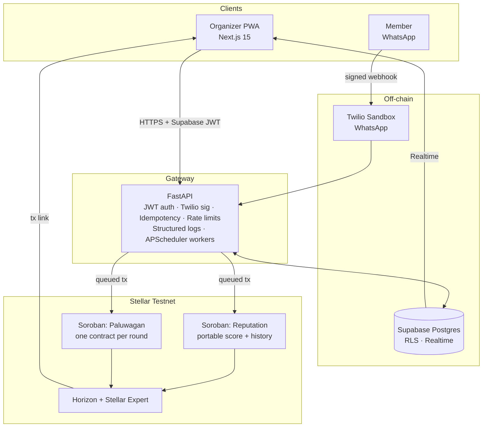

# DAMAY — Paluwagan by Damay

**Trustless rails for the Philippines' ₱100B/year informal savings circles.**

  

---

## What is DAMAY?

A **paluwagan** is a Filipino rotating savings circle: six neighbors agree to put in ₱500 every Saturday, and every week someone different takes the pot. Six weeks, six payouts, ₱3,000 each. No bank, no interest, no paperwork — just six people who trust each other enough to wait their turn. An estimated **18M Filipinos** (BSP Financial Inclusion Survey, est.) participate in paluwagan-like circles. Roughly **₱100B** (est.) cycles through them every year. Zero of it touches financial rails.

The trust holds until it doesn't. The organizer "Ate" who collects the contributions ghosts the group chat. A member two cycles in stops sending GCash receipts. Someone takes their payout and disappears. Default rates in non-kin paluwagan are commonly cited as materially worse than kin-based ones — and when it breaks, there is no recourse, no record, and no portable reputation that follows the defaulter to the next circle.

DAMAY puts the trust layer on Stellar. Every contribution and payout is a Soroban transaction, signed and observable on Stellar Expert. Every on-time payment, default, or completed cycle writes to a reusable **Reputation Trustline** contract that any future product can read. Members never leave WhatsApp — that's where the actual users already live; the organizer gets a web dashboard with live timelines and on-chain receipts. Same group-chat UX, now with cryptographic receipts and a portable trust score.

## Architecture



**Why this shape.** API gateway in front means we can swap WhatsApp for SMS or Telegram later without touching contracts. Supabase is the off-chain source of truth (profiles, message logs, idempotency keys); Stellar is the on-chain source of truth (value transfer + reputation deltas). Writes to chain are queued through a job table so the user-facing webhook always returns 200 within the Twilio retry window.

## Tech stack

- **Smart contracts** — Rust + Soroban SDK `22.0.0`, `stellar-cli` 22.8.1, Stellar **testnet** via Horizon + Soroban RPC
- **Web** — Next.js 15 (App Router, RSC, Server Actions), shadcn/ui, Tailwind, PWA shell
- **API** — FastAPI + Pydantic v2, `structlog` JSON logs, `apscheduler` workers, `pybreaker` circuit breakers, `slowapi` rate limiting
- **Data** — Supabase Postgres with RLS-by-default, Supabase Realtime for live timelines, Supabase magic-link auth (organizer side only)
- **Messaging** — Twilio WhatsApp sandbox (HMAC-SHA1 signature verified)
- **Deploy** — Multi-stage Dockerfiles, EasyPanel on bare-metal, GHCR for images
- **Observability** — Sentry (web + api, separate DSNs), structured request-id correlation
- **Tests** — `cargo test` (contracts), `pytest` (api), Playwright (E2E)

## Stellar primitives used

These are what the judges should grep for. We use Stellar as a settlement and reputation layer, not as a logo on a slide.

1. **Reputation Trustline (custom Soroban contract)** — `init`, `record_contribution`, `record_default`, `record_payout_received`, `get_score`, `get_history`, `get_admin`. Score formula `+10 / -25 / +1` with **1%-per-30-day decay** applied against `ledger.timestamp`. Bounded 100-entry history per member (FIFO prune, no storage griefing). Reusable across future products (Late-Night Lend reads from the same contract).
2. **Paluwagan round state machine (custom Soroban contract)** — `init_round`, `contribute`, `distribute_payout`, `close_round`, `get_state`. Recipient schedule `members[cycle - 1]`. Payout is **permissionless** once the cycle deadline passes and every member has contributed — anyone can trigger it; the contract still routes to the correct address.
3. **Typed Soroban events on every mutation** — `("rep","contrib")`, `("rep","default")`, `("rep","payout")`, `("pal","init")`, `("pal","contrib")`, `("pal","payout")`, `("pal","closed")`. Every event observable from Stellar Expert; the dashboard links to each tx hash.
4. **Idempotent on-chain writes via a queued worker** — the HTTP webhook is never blocked on chain latency. Every write goes into `stellar_jobs` with an idempotency key keyed on `(job_type, target_id, cycle)`. Workers retry with `0.5s / 1s / 2s` exponential backoff + jitter, dead-letter after three permanent failures, alert the organizer on dead-letter.
5. **`require_auth` on every state-mutating function** — admin for reputation writes, organizer for round init/close, member for contribute. `distribute_payout` is intentionally permissionless (gated by deadline + completeness checks).

Arithmetic is uniformly `saturating_*`. No `unwrap` on user-supplied data. No cross-contract calls from mutating paths (no re-entry surface).

## Repo layout

```
damay/
├── apps/
│   ├── web/             Next.js 15 organizer PWA (App Router, RSC)
│   └── api/             FastAPI gateway + workers, Supabase migrations
├── contracts/
│   ├── reputation/      Soroban contract — portable per-member score
│   └── paluwagan/       Soroban contract — one round, one deployment
├── packages/
│   ├── ui/              shared design tokens + shadcn theming
│   └── types/           OpenAPI-derived TS types
├── scripts/             deploy_testnet.sh, preflight.sh, env-parity.sh
├── docs/                screenshots + judge collateral
├── ARCHITECTURE.md      service topology, API contracts, sequence diagrams
├── EASYPANEL_DEPLOY.md  step-by-step prod deploy runbook
├── SECURITY_REVIEW.md   Phase 5 security pass (PASS_WITH_NOTES, 0 High)
├── DEMO_SCRIPT.md       3-minute judge demo, verbatim
├── PITCH.md             one-page pitch
├── VIDEO_SHOTS.md       90s vertical + 3min landscape shot lists
├── deployments.json     contract IDs + WASM hashes
├── easypanel.yml        prod manifest
└── docker-compose.yml   prod-shape local mirror
```

## Live demo

- Web — `https://damay.kenbuilds.tech` *(live after Phase 4 deploy)*
- API — `https://api.damay.kenbuilds.tech/docs` *(OpenAPI; live after Phase 4 deploy)*

## Contract addresses (Stellar testnet)

`deployments.json` currently reports `status: PENDING_DEPLOY` — the build environment cannot reach `*.stellar.org`. Both contracts are built, 48/48 contract tests green in sandbox; live IDs populate after `bash scripts/deploy_testnet.sh` from any machine with public network access. The WASM hashes below are reproducible from committed source with `soroban-sdk 22.0.0` and `stellar-cli 22.8.1`.

| Contract     | Status            | WASM hash (sha256)                                                 | Live ID                                                  |
|--------------|-------------------|--------------------------------------------------------------------|----------------------------------------------------------|
| `reputation` | PENDING_DEPLOY    | `996344cbb43d343d64609f57c2e053529c8b59c180de1fa4d8cd4bf18ca82b9c` | populates on first deploy → `deployments.json`           |
| `paluwagan`  | PENDING_DEPLOY    | `9198eaa9b361d90639fd1bfc55d28329c23328d0be8facf9cd2d267a9cb87b6f` | populates on first deploy → `deployments.json`           |

Deployer: `GD22MZHXUBPRZRPPZFL5CEE6VZ6O3CKDE3BTFXRCYZY7EBK23I5WQP7D`. Once IDs are live, every contribution row in the dashboard links to `https://stellar.expert/explorer/testnet/contract/<id>`.

## Local setup

```bash
git clone https://github.com/KpG782/damay.git && cd damay
cp .env.example .env.local                                       # fill values (see EASYPANEL_DEPLOY.md §4)
pnpm install                                                     # web + packages
( cd apps/api && uv sync )                                       # api deps
( cd contracts && cargo test --all )                             # 48/48 contract tests
pnpm dev                                                         # web on :3000
( cd apps/api && uv run uvicorn main:app --reload --port 8000 )  # api on :8000
docker compose --env-file .env.local up --build                  # optional: prod-shape mirror
```

## Demo steps

1. `bash scripts/deploy_testnet.sh` — populate `deployments.json` with live contract IDs.
2. `psql "$SUPABASE_DB_URL" -f apps/api/supabase/migrations/0001_initial.sql` then `0002_seed.sql` — load schema + the **Kapitbahay Kalsada 7** demo round.
3. `pnpm dev` (web) + `uv run uvicorn main:app` (api) — or `docker compose up`.
4. Sign in to `/dashboard` as the demo organizer; open the seeded active round.
5. From a second tab, `POST /v1/dev/simulate-message` (or text the Twilio sandbox `PAY` for the cycle-1 contribution). Watch the timeline tick live via Supabase Realtime, then click through to Stellar Expert to see the on-chain event.
6. Walk the full [`DEMO_SCRIPT.md`](DEMO_SCRIPT.md) — 3:00, verbatim.

## Test suite

```bash
( cd contracts && cargo test --all )                              # 48 contract tests + 2 saturation fuzz cases
( cd apps/api && uv run pytest )                                  # 63 backend tests
pnpm --filter @damay/e2e exec playwright test                     # 14 end-to-end flows
```

Current count: **63 backend + 50 contract + 14 Playwright = 127 green.** Contract fuzz: 1000 random sequences against the Paluwagan state machine, no panics. Webhook replay: same Twilio payload twice, exactly one side effect. Security: `gitleaks` clean, **0 High** findings (see `SECURITY_REVIEW.md`).

## Roadmap

- **v1.1** — partner-backed PHP rails (cash-in via GCash, cash-out via Maya / InstaPay), Late-Night Lend intent layer (stub today, live in v1.1; reads the same Reputation Trustline), member-facing PWA for power users who prefer a screen over a chat.
- **v1.2** — multi-currency rounds (USDC for OFW remittance circles), agent layer where any third-party app can read a portable DAMAY score with the member's consent, organizer payouts to multiple recipients per cycle.
- **v2** — mainnet, BSP-friendly KYC tier, cooperative-grade audit trail exports, white-label for barangay LGUs and parish credit cooperatives.

## Team

**Ken Patrick Garcia** — full-stack AI engineer, Manila. [kenbuilds.tech](https://kenbuilds.tech). DAMAY shipped solo using a Claude Code subagent orchestration pattern: 10 specialized agents (architect, soroban-engineer, backend-engineer, frontend-engineer, ui-designer, whatsapp-integrator, devops, qa-engineer, security-reviewer, docs-writer) coordinated through a single `CLAUDE.md` playbook. The pattern is the product behind the product.

## License

MIT. See [`LICENSE`](LICENSE).
